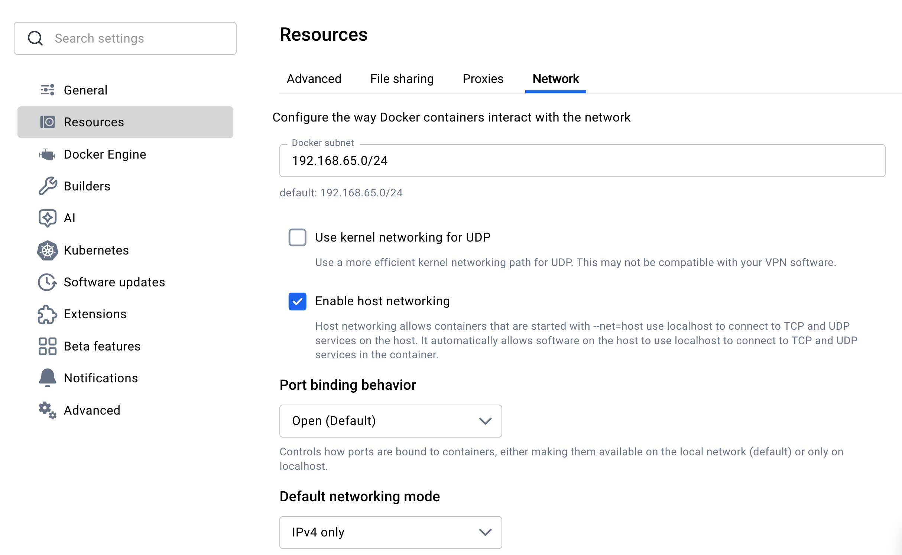

# Specmatic Workshop Labs
Contains all the labs used during the Specmatic hands-on workshop.

## Time required to complete each lab:
10-15 minutes.

## Prerequisites
- Docker Engine installed and running on your machine
- Ensure host networking is enabled in Docker Desktop on your machine. In Docker Desktop, go to Settings > Resources > Network and enable `Enable Host Networking`. This allows the containers to access services running in Docker using `localhost`
 
- An IDE (IntelliJ, VS Code, etc.) 

## Getting Started
Clone the repository to your local machine: 
```bash 
git clone https://github.com/specmatic/labs
```

## Lab Structure 
This is a monorepo. Each lab is self-contained and organized in a separate directory, with its own README file containing instructions and code examples.

## Workshop Schedule 
- Overview
  - Independent Development and Deployment 
    - Understand how microservices are meant to reduce dependencies and enable parallel development, 
    - Why integration environments become bottlenecks, 
    - How shifting feedback earlier using contract testing and service virtualization can unblock delivery and improve stability.
  - Test Pyramid - Contract Testing, API Testing, API Workflow Testing
    - Learn the difference between: 
      - Contract tests (API standards, structure and schema)
      - API tests (functional correctness of single API)
      - API workflow tests (orchestrate integration across multiple APIs) 
    - Understand how contract testing acts like "compiler safety" for APIs, ensuring systems integrate reliably across services.
  - Types of Contract Driven Development (Spec-First API Design, PDCT & CDCT)
    - Contract-Driven Development (CDD) is a software development approach that emphasizes using API specifications as a source of truth for design, development and testing both locally and in CI pipelines. This approach ensures that all stakeholders have a clear understanding of the API's behavior, inputs, outputs, and interactions from the outset. By converting the API Specs into executable contracts this approach enables providers and consumers to work in parallel, reduces integration issues, and improves overall API quality. There are several types of Contract-Testing, and we'll cover each of them in detail.
      - Spec-First API Design: Emphasizes designing the API contract first, often using specifications like OpenAPI or AsyncAPI, before any code is written. Then using those specifications to ensure backward compatibility and drive development and testing.
      - Provider-Driven Contract Testing (PDCT): Focuses on testing the provider's implementation against the defined contract to ensure it meets the specified requirements.
      - Consumer-Driven Contract Testing (CDCT): Focuses on testing the interactions between a consumer and a provider based on the consumer's expectations.
  - Contract Driven Development (CDD) in Action Demo - Using [Order-BFF](order-bff/README.md) as an example
    - See how contract-driven development enables teams to test services in isolation using mocks, simulate real-world scenarios, and orchestrate end-to-end API flows without writing single line of test code.
- Spec-First Contract-Driven Core Concepts 
  - [Contract Testing](quick-start-contract-testing/README.md)
    - API Contract Test
    - Using Inline examples as test data
    - Using External examples as test data
  - [Intelligent service virtualization](quick-start-mock/README.md)
    - Inline Examples as mock data 
    - External examples as mock data
  - [API Testing](quick-start-api-testing/README.md)
    - Using matchers to assert specific values in the API response
  - [API Coverage](api-coverage/README.md)
    - Using the app's published OpenAPI document to detect implemented routes missing from the checked-in spec
  - [Backward Compatibility Testing](backward-compatibility-testing/README.md)
    - Ensure changes to your API don't accidentally break your consumers
- Examples - Simplified Test Data Management
  - [Generate, Validate and Fix examples](external-examples/README.md)
  - [Partial examples](partial-examples/README.md)
  - [Domain-aware requests using Dictionary](dictionary/README.md)
  - [Response Templating via Direct substitution and Data lookup](response-templating/README.md)
- Specmatic Features
  - [Filters](filters/README.md)
  - [Request/Response Adapters](data-adapters/README.md)
  - [Overlays](overlays/README.md)
  - [Workflow within the Same Spec](workflow-in-same-spec/README.md)
  - [Running Contract Tests and Mocks in CI](continuous-integration/README.md)
- Event Driven Architecture with AsyncAPI
  - [AsyncAPI Contract Testing](quick-start-async-contract-testing/README.md)
  - [Kafka and Avro Schema](kafka-avro/README.md)
  - [Async Event Flow](async-event-flow/README.md)
  - [Kafka to SQS Retry and DLQ](kafka-sqs-retry-dlq/README.md)
- Advanced Testing Concepts
  - [API Security Schemes](api-security-schemes/README.md)
  - [Schema Resiliency Testing](schema-resiliency-testing/README.md)
  - [Schema Design](schema-design/README.md)
  - [API Workflow Testing](arazzo-workflow-testing/README.md)
  - [API Resiliency Testing](api-resiliency-testing/README.md)
- GenAI in Action
  - [MCP Auto Test](mcp-auto-test/README.md)
  - [Specmatic as a Guardrails for Coding Agents](coding-agents/README.md)

## Additional Resources 
For more information on Specmatic and its features, please refer to the official documentation: [Specmatic Documentation](https://docs.specmatic.in)

Happy learning!
