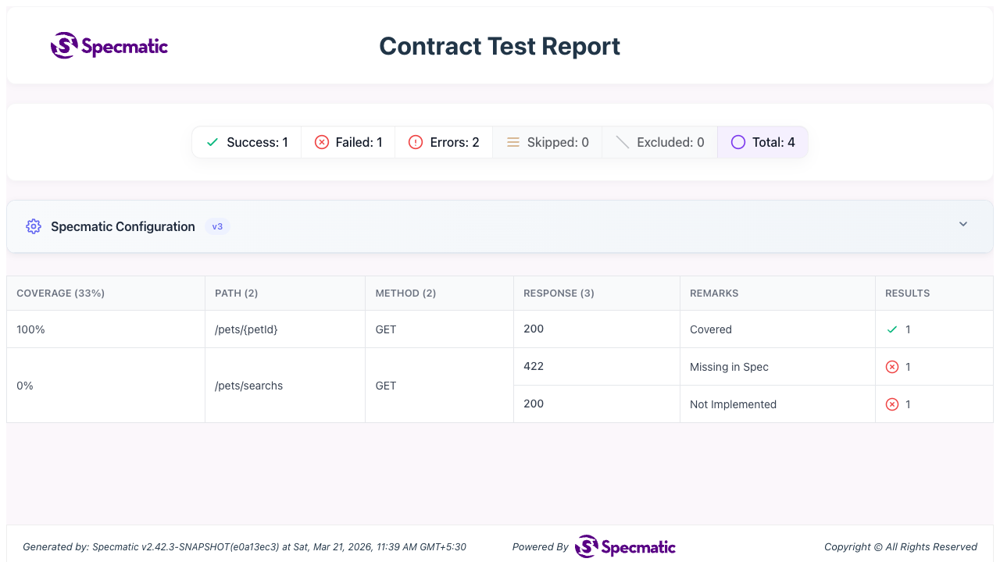

# API Coverage for OpenAPI Using the App's Published Spec

## Objective
Learn how Specmatic calculates OpenAPI API coverage by combining:
- contract tests generated from the spec, and
- routes discovered from the OpenAPI spec derived from application's controller.

## Why this lab matters
Contract tests only exercise what is present in your spec. API coverage adds another question:

Is the application exposing additional routes that are implemented by the app, but missing from the spec?

That is the gap this lab demonstrates.

## Time required to complete this lab
10-15 minutes.

## Prerequisites
- Docker is installed and running.
- You are in `labs/api-coverage-openapi`.
- Port `8080` is available.

## API Coverage Overview Video
[](https://www.youtube.com/watch?v=oY7Xw37cHLc)

## Architecture
- `service/app/main.py` runs a tiny FastAPI provider on port `8080`.
- FastAPI has a builtin mechanism to publish the app's OpenAPI document at `http://127.0.0.1:8080/openapi.json`.
- `specs/service.yaml` is the published contract used by Specmatic to generate contract tests.
- `specmatic.yaml` tells Specmatic where the app is running, app's published OpenAPI document and how to fetch dynamically the OpenAPI spec for API coverage enrichment.

## Files in this lab
- `specs/service.yaml` - intentionally stale OpenAPI contract used by Specmatic.
- `specmatic.yaml` - Specmatic config with `baseUrl`, `swaggerUrl`, and API coverage thresholds.
- `service/app/main.py` - FastAPI provider implementation.
- `docker-compose.yaml` - runs the provider and Specmatic test runner.

## Learner task
Fix the typo in `specs/service.yaml` by changing `GET /pets/search` to `GET /pets/find`.

## Lab Rules
- Do not edit `service/app/main.py`.
- Do not edit `specmatic.yaml`.
- Do not edit `docker-compose.yaml`.
- Edit only `specs/service.yaml`.

## Specmatic references
- Contract testing overview: [https://docs.specmatic.io/documentation/contract_testing.html](https://docs.specmatic.io/documentation/contract_testing.html)
- [Early detection of mismatches between your API specs and implementation](https://specmatic.io/demonstration/detect-mismatches-between-your-api-specifications-and-implementation-specmatic-api-coverage-report/)

## How coverage works in this lab
Specmatic first runs contract tests generated from the provided spec.

For coverage enrichment, Specmatic pulls the latest Swagger/OpenAPI from the path specified in `swaggerUrl`

This lab uses:
- `systemUnderTest.service.runOptions.openapi.baseUrl` points contract tests to `http://petstore:8080`
- `systemUnderTest.service.runOptions.openapi.swaggerUrl` points coverage enrichment to `http://petstore:8080/openapi.json`

That means:
- the `specs/service.yaml` controls which contract tests are generated
- the dynamically generated OpenAPI spec at `http://petstore:8080/openapi.json` tells Specmatic which routes the application is actually exposing

## Publishing OpenAPI in Different Tech Stacks
This lab uses FastAPI, which can publish OpenAPI dynamically at `/openapi.json`. The same idea applies in other stacks as well, even though the tooling and published URL may differ.

- **Spring Boot**: Teams commonly use `springdoc-openapi`, often together with Swagger UI, to dynamically generate and publish the OpenAPI spec from controller annotations and request mappings.
- **Node.js / Express**: Teams commonly use packages such as `swagger-jsdoc` with `swagger-ui-express`, or similar OpenAPI tooling, to generate and publish the spec from code annotations or configuration.
- **ASP.NET**: Teams commonly use Swashbuckle to generate and publish OpenAPI for ASP.NET Core controllers, usually along with Swagger UI.

The important point for API coverage is not the specific library. What matters is that the application exposes a current OpenAPI document that Specmatic can fetch using `swaggerUrl`.

## 1. Baseline run (intentional coverage failure)
Run:

```shell
docker compose up test --build --abort-on-container-exit
```

Expected behavior:
- The contract test for `GET /pets/{petId}` passes.
- The contract test for `GET /pets/search` fails because the application does not implement that route.
- Specmatic fetches the app's dynamically generated OpenAPI document from `/openapi.json`.
- Coverage report shows `/pets/find` as `Missing In Spec`.
- Coverage report also shows `/pets/search` as `Not Implemented`.
- The run fails because API coverage is enforced with:
  - `minCoveragePercentage: 100`
  - `maxMissedOperationsInSpec: 0`

Expected result summary:

```terminaloutput
Tests run: 2, Successes: 1, Failures: 1, Errors: 0
```

Expected coverage highlight:

```terminaloutput
100%     /pets/{petId}  GET   200   1   covered 
0%       /pets/search   GET   200   1   not implemented
0%       /pets/find     GET   0     0   missing in spec
```

Expected gate failure highlight:

```terminaloutput
Failed the following API Coverage Report success criteria:
Total API coverage: 50% is less than the specified minimum threshold of 100%.
Total missed operations: 1 is greater than the maximum threshold of 0.

```

Clean up:

```shell
docker compose down -v
```

Also inspect the generated HTML report after the run:

- Open `build/reports/specmatic/test/html/index.html` in your browser.
- Review the same mismatch in the CTRF HTML report.
- You should see `/pets/search` reported as `Not Implemented`.
- You should also see `/pets/find` reported as `Missing in Spec`.

Example baseline CTRF HTML report:



## 2. Fix the checked-in spec
Open `specs/service.yaml`.

Find this path:

```yaml
/pets/search:
  get:
```

Change it to:

```yaml
/pets/find:
  get:
```

Do not change anything else in the operation.

## 3. Re-run the tests and coverage check
Run the same command again:

```shell
docker compose up test --build --abort-on-container-exit
```

Expected final result:

```terminaloutput
Tests run: 2, Successes: 2, Failures: 0, Errors: 0
```

Expected coverage outcome:
- `/pets/{petId}` is `covered`
- `/pets/find` is `covered`
- no paths remain `Missing In Spec`
- no paths remain `Not Implemented`
- API coverage success criteria pass

Clean up:

```shell
docker compose down -v
```

## Verify generated HTML report
After a run, Specmatic also generates report artifacts inside this `build/reports/specmatic` folder.

Important file:
- `build/reports/specmatic/test/html/index.html`

After you fix the spec, this JSON report should include both operations:
- `GET /pets/{petId}`
- `GET /pets/find`

The HTML report is useful both before and after the fix:
- before the fix, it shows the coverage mismatch in a more readable UI
- after the fix, it confirms both paths are covered

## Short Studio follow-up
Start Studio and the provider:

```shell
docker compose --profile studio up --build
```

Then:
1. Open [Specmatic Studio](http://127.0.0.1:9000/_specmatic/studio).
2. Open `specs/service.yaml` from the left file tree.
3. Go to the **Test** tab.
4. Set URL to `http://petstore:8080`.
5. Run the tests.

In a separate browser tab, open:
- [FastAPI Swagger UI](http://127.0.0.1:8080/docs)

What to observe before fixing the checked-in spec:
- Studio tests only the checked-in `service.yaml`, so it runs the `/pets/search` scenario from the given spec.
- The FastAPI Swagger UI shows that the app actually publishes `GET /pets/find`.
- That mismatch is why the coverage report marks `/pets/find` as `Missing In Spec` and `/pets/search` as `Not Implemented`.

Stop Studio and the provider:

```shell
docker compose --profile studio down -v
```

## Pass criteria
- Baseline run has `1` passing test and `1` failing test.
- Coverage report shows `/pets/find` as `Missing In Spec`.
- Coverage report shows `/pets/search` as `Not Implemented`.
- After fixing the typo in `specs/service.yaml`, the rerun passes with `2/2` successful tests and no missed or unimplemented paths.

## Troubleshooting
- If the test runner starts before the provider is ready, rerun after `docker compose down -v`.
- If results look stale, use `--build` exactly as documented.
- If you do not see `/pets/find` in Swagger UI, confirm the provider is running on `127.0.0.1:8080`.
- If the first run does not fail as expected, confirm the checked-in spec still says `/pets/search` and not `/pets/find`.

## What you learned
- Contract tests are generated only from the checked-in spec.
- API coverage can enrich those results using routes discovered from the running application.
- With `swaggerUrl`, Specmatic can dynamically fetch the app's generated OpenAPI document and identify implemented routes missing from the spec.
