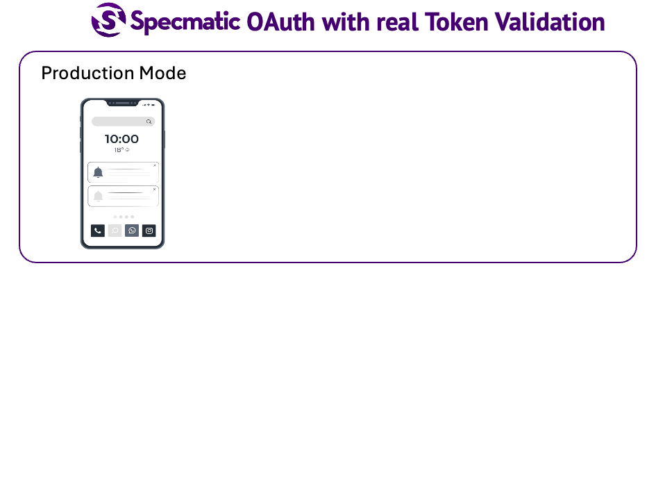

# Specmatic Sample Application to demonstrate OpenAPI Multiple Security Schemes Support


This project demonstrates how to leverage OpenAPI specifications as a Contract Test with Specmatic when the specification includes multiple [security schemes](https://spec.openapis.org/oas/v3.0.1#security-scheme-object) to protect different endpoints based on HTTP methods.

Run the contract tests, observe the authentication failures, then fix [`specmatic.yaml`](specmatic.yaml) so Specmatic sends the right OAuth2, Basic Auth, and API key values.

## Time required to complete this lab
10-15 minutes.

## Prerequisites
- Docker is installed and running.
- You are in `labs/api-security-schemes`.

## Architecture

- `Keycloak` acts as the OAuth2 authorization server for `POST` requests.
- `Order API` is the system under test and enforces:
  - OAuth2 for `POST`
  - Basic Auth for `GET`
  - API key for `DELETE`
- `Specmatic` reads the OpenAPI contract, looks up matching `securitySchemes` entries in `specmatic.yaml`, and sends auth headers during contract tests.

The application validates OAuth2 tokens by calling the ```spring.security.oauth2.resourceserver.jwt.issuer-uri``` url defined in the ```application.properties``` file.

## Security Schemes

The application uses three security schemes:

- **OAuth2 (POST endpoints)**: Requires a bearer token with the `email` scope.
- **Basic Authentication (GET endpoints)**: Requires valid username/password credentials.
- **API Key (DELETE endpoints)**: Requires a valid `X-API-Key` header.

The OpenAPI contract defines these schemes:

**1. POST endpoints with OAuth2** :
```yaml
  securitySchemes:
    oAuth2AuthCode:
      type: oauth2
      description: keycloak based oauth security example
      flows:
        authorizationCode:
          authorizationUrl: http://localhost:8083/realms/specmatic/protocol/openid-connect/auth
          tokenUrl: http://localhost:8083/realms/specmatic/protocol/openid-connect/token
          scopes:
            email: email
```

**2. GET endpoints with Basic Auth*:
```yaml
  securitySchemes:
    basicAuth:
      type: http
      scheme: basic
      description: Basic Authentication with username and password
```

**3. DELETE endpoints with API Key**:
```yaml
  securitySchemes:
    apiKeyAuth:
      type: apiKey
      in: header
      name: X-API-Key
      description: API Key based authentication
```

Specmatic will check if these security schemes are defined in the ```specmatic.yaml``` configuration.  
If found, it will use the configured values; otherwise, it will auto-generate appropriate authentication headers.

The security schemes are defined in ```specmatic.yaml```:
```yaml
specs:
  - spec:
      id: orderApiSpec
      securitySchemes:
        oAuth2AuthCode:
          type: oauth2
          token: ${INVALID_OAUTH_TOKEN:OAUTH1234}
        basicAuth:
          type: basicAuth
          token: ${BASIC_AUTH_TOKEN:dXNlcjppbnZhbGlkcGFzcw==}
        apiKeyAuth:
          type: apiKey
          token: ${API_KEY:INVALID_APIKEY1234}
```

## Lab Rules

- Do not edit the specs checked out under `.specmatic/repos/labs-contracts/openapi/security/` in this lab.
- Do not edit `docker-compose.yaml`.
- Edit only [`specmatic.yaml`](specmatic.yaml).

## Intentional Failure

Because the OUATH token name and the default values for the BASIC_AUTH_TOKEN and API_KEY in `specmatic.yaml` are intentionally wrong, the protected endpoints return `401 Unauthorized`.

## Run the failing tests

From `labs/api-security-schemes`, run:

```shell
docker compose up specmatic-test --abort-on-container-exit
```

Expected failing result:

- The compose command exits with a non-zero code.
- Specmatic reports failures against secured endpoints.
- The failures include `401 Unauthorized` responses.

Since OUATH token name and the default values for the BASIC_AUTH_TOKEN and API_KEY in [`specmatic.yaml`](specmatic.yaml) is invalid, Specmatic sends invalid credentials and the protected endpoints return `401 Unauthorized`.

Cleanup after each run:

```shell
docker compose down -v
```

## Your Task

Update [`specmatic.yaml`](specmatic.yaml) to valid values again:

- `INVALID_OAUTH_TOKEN` to `OAUTH_TOKEN`
- `dXNlcjppbnZhbGlkcGFzcw==` to `dXNlcjpwYXNzd29yZA==`
- `INVALID_APIKEY1234` to `APIKEY1234`

Do not change anything else. Fix only the above values.

## Verify the fix

Re-run:

```shell
docker compose up specmatic-test --abort-on-container-exit
```

Expected passing result:

- All 167 tests pass.
- The compose command exits with code `0`.
- Specmatic output ends with `Failures: 0`.

Generated test reports:
- `build/reports/specmatic/test/html/index.html`

## Troubleshooting

- If Docker ports `8080` or `8083` are already in use, stop the conflicting process and try again.
- If containers from a previous run are still present, run `docker compose down -v` before retrying.
- If Keycloak takes a little longer to start, wait for the compose run to finish; the test container already includes readiness checks.
- If tests still fail after your change, compare the three token fallback values in `specmatic.yaml` against the valid values shown in the lab.
