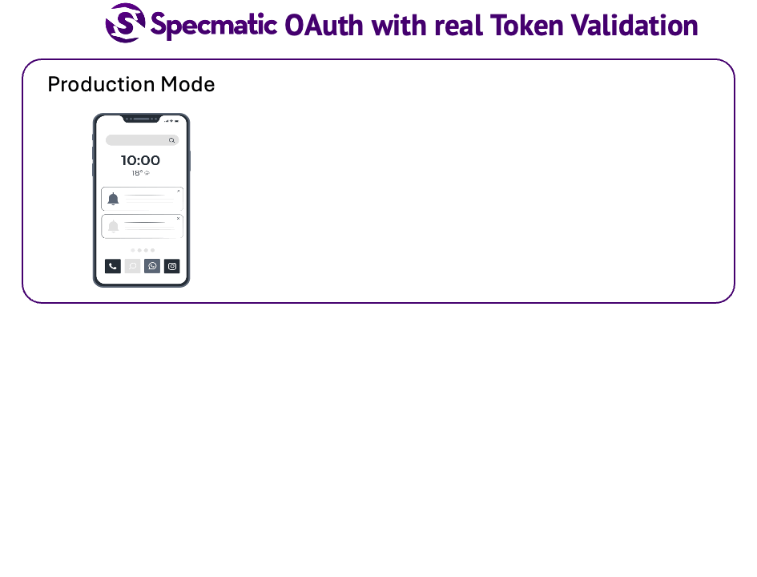

# Specmatic Sample Application to demonstrate OpenAPI Multiple Security Schemes Support


This project demonstrates how to leverage OpenAPI specifications as a Contract Test with Specmatic when the specification includes multiple [security schemes](https://spec.openapis.org/oas/v3.0.1#security-scheme-object) to protect different endpoints based on HTTP methods.

The lab starts in an intentionally broken state. Your job is to observe the failures, understand how each auth mechanism is wired, and make the smallest fixes needed to get the contract tests passing again.

## Time required to complete this lab
10-15 minutes.

## Prerequisites
- Docker is installed and running.
- You are in `labs/api-security-schemes`.

## Architecture

- `Vault` stores the credentials used by the contract tests, and `vault-init` loads the demo credentials into Vault.
- `Keycloak` acts as the OAuth2 authorization server for `POST` and `PATCH` requests.
- `Order API` is the system under test, requires mTLS, and enforces:
  - OAuth2 scopes and RBAC for `POST` and `PATCH`
  - Basic Auth for `GET`
  - API key auth for `DELETE`

The application uses the issuer configured by ```spring.security.oauth2.resourceserver.jwt.issuer-uri``` to validate OAuth2 tokens and checks the granted scope before allowing each protected operation.

## Security Schemes

The OpenAPI contract uses three application-level security schemes:

- **OAuth2 (POST and PATCH endpoints)**: Requires a bearer token with the appropriate operation scope.
- **Basic Authentication (GET endpoints)**: Requires valid username/password credentials.
- **API Key (DELETE endpoints)**: Requires a valid `X-API-Key` header.

The Order API also requires Specmatic to present a trusted client certificate. This is configured under `runOptions.openapi.cert` in [`specmatic.yaml`](specmatic.yaml). The certificates under [`certs/`](./certs) are public, demo-only fixtures and must not be reused outside this lab.

The OpenAPI contract defines these schemes:

**1. POST and PATCH endpoints with OAuth2** :
```yaml
  securitySchemes:
    oAuth2AuthCode:
      type: oauth2
      description: keycloak based oauth security example
      flows:
        authorizationCode:
          authorizationUrl: http://localhost:8083/realms/specmatic/protocol/openid-connect/auth
          tokenUrl: http://localhost:8083/realms/specmatic/protocol/openid-connect/token
          scopes:
            email: email
            order:create: Create orders
            product:create: Create products
```

**2. GET endpoints with Basic Auth**:
```yaml
  securitySchemes:
    basicAuth:
      type: http
      scheme: basic
      description: Basic Authentication with username and password
```

**3. DELETE endpoints with API Key**:
```yaml
  securitySchemes:
    apiKeyAuth:
      type: apiKey
      in: header
      name: X-API-Key
      description: API Key based authentication
```

## Basic and API Key

Specmatic will check if these security schemes are defined in the ```specmatic.yaml``` configuration.  
If found, it will use the configured values; otherwise, it will auto-generate appropriate authentication headers.

The security schemes are defined in ```specmatic.yaml```:
```yaml
specs:
  - spec:
      id: orderApiSpec
      securitySchemes:
        basicAuth:
          type: basicAuth
          token: ${BASIC_AUTH_TOKEN:ZGVmYXVsdC11c2VyOmRlZmF1bHQtdXNlcgo=}
        apiKeyAuth:
          type: apiKey
          token: ${API_KEY:INVALID_APIKEY1234}
```

## OAuth with RBAC

Unlike the Basic Auth and API key schemes, OAuth is not configured here as a single static token value in [`specmatic.yaml`](specmatic.yaml).

Instead, the OAuth/RBAC `POST` and `PATCH` examples under [`auth_examples/`](./auth_examples) use Specmatic `before` fixtures:
1. The `before` fixture calls the Keycloak token endpoint and requests either `order:create` or `product:create`.
2. The fixture captures `access_token` as `ACCESS_TOKEN`.
3. The protected API request should use this captured token in the `Authorization` header.

Keycloak uses the `users` and `admins` roles to determine which scope each account may obtain. `user1` may obtain `order:create`, while `service_account` may obtain `product:create`. The Order API authorizes the request using the granted scope in the token.

## Lab Rules

- Do not edit `docker-compose.yaml`.
- Do not edit the specs checked out under `.specmatic/repos/labs-contracts/openapi/security/` in this lab.
- Edit only the example files under [`auth_examples/`](./auth_examples).

## Intentional Failure

This lab is intentionally broken in one place:
1. The [OAuth example](./auth_examples) files are missing the `Authorization` header in the `POST` and `PATCH` requests

Because of that:
- OAuth `before` fixtures run, but the protected `POST` and `PATCH` requests do not send the fetched token

## Run the failing tests

From `labs/api-security-schemes`, run:

```shell
docker compose up specmatic-test --abort-on-container-exit
```

Expected failing result:

```terminaloutput
Tests run: 185, Successes: 167, Failures: 18, WIP: 0, Errors: 0
```

- The compose command exits with a non-zero code.
- Specmatic reports failures against secured endpoints.
- The failures include `401 Unauthorized` responses.

For the OAuth failures, look carefully at the logs:
- The `before` fixture should run
- The token fetch request to Keycloak should succeed
- However, the protected `POST` or `PATCH` request will still fail because it is not using the captured token

Cleanup after each run:

```shell
docker compose down -v
```

## Your Task

### Restore the bearer token wiring in the OAuth examples

Inspect all `POST` and `PATCH` examples under [`auth_examples/`](./auth_examples), including both success and forbidden variants.
In each protected request, add the `Authorization` header using the captured `ACCESS_TOKEN` from the `before` fixture:

```plaintext
"Authorization": "Bearer $(ACCESS_TOKEN)"
```

## Verify the fix

Re-run:

```shell
docker compose up specmatic-test --abort-on-container-exit
```

Expected result:

```terminaloutput
Tests run: 185, Successes: 185, Failures: 0, WIP: 0, Errors: 0
```

Cleanup after run:

```shell
docker compose down -v
```

Generated test reports:
- `build/reports/specmatic/test/html/index.html`

## Troubleshooting

- If Docker ports `8443`, `8083`, or `8200` are already in use, stop the conflicting process and try again.
- If containers from a previous run are still present, run `docker compose down -v` before retrying.
- If Keycloak takes a little longer to start, wait for the compose run to finish; the test container already includes readiness checks.
- If the OAuth token request succeeds but the protected `POST` or `PATCH` still fails, check whether the example request is missing the `Authorization` header.

## Next step
If you are doing this lab as part of an eLearning course, return to the eLearning site and continue with the next module.
