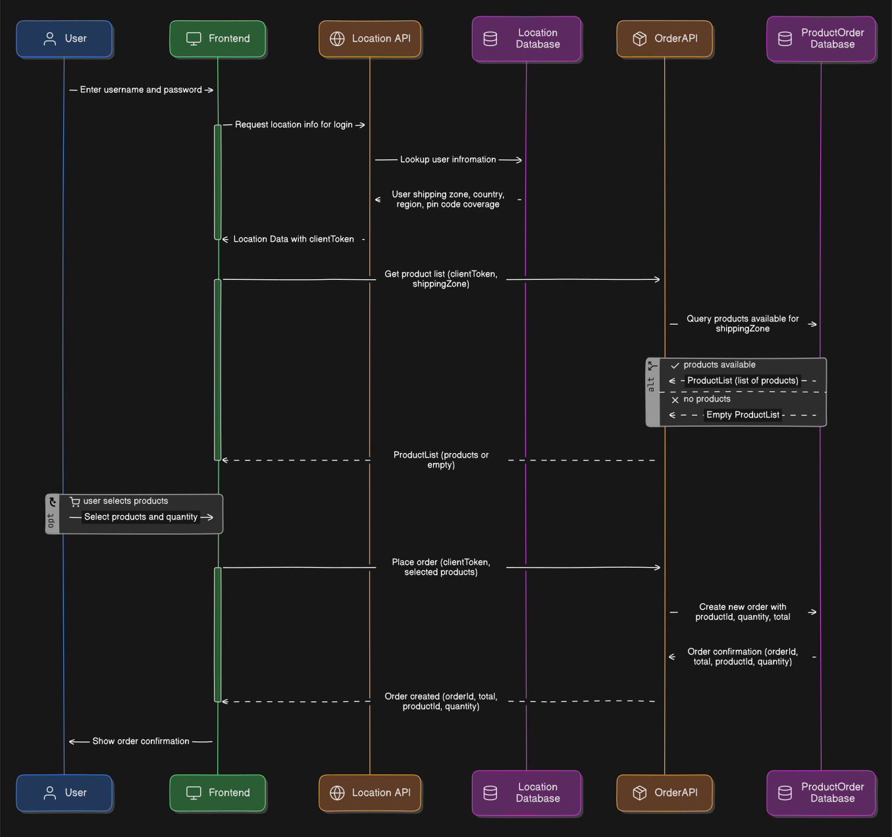

# API Workflow Testing using Arazzo

Want to test the functionality of an entire business workflow of your microservices architecture that involves both synchronous HTTP calls and asynchronous event-driven interactions?


Using a simple drag-and-drop approach, Specmatic-Arazzo facilitates generating an entire workflow and exporting it as an industry-standard Arazzo specification. Once you've created the Arazzo specification, you can leverage Specmatic-Arazzo to perform end-to-end workflow testing and mocking for your microservices architecture.

More details: https://docs.specmatic.io/supported_protocols/arazzo

## Sequence Diagram



## Time required to complete this lab:
10-15 minutes.

## Prerequisites
- Docker is installed and running.
- You are in `labs/arazzo-workflow-testing`.

## API Workflow Testing Overview Video
[](https://www.youtube.com/watch?v=baYcsznD_Mk)

## Getting Started

Start the full stack using Docker Compose:

```shell
docker compose up --build
```

This launches the following services:

| Service           | Port | Description                    |
|-------------------|------|--------------------------------|
| **Location API**  | 3000 | Provides user location details |
| **Products API**  | 3001 | Returns products by location   |
| **Order API**     | 3002 | Handles order lifecycle        |
| **Warehouse API** | 3003 | Manages inventory operations   |
| **Kafka**         | 9092 | Internal broker port           |
| **Postgres**      | 5432 | Shared database                |

Start Studio
```shell
docker compose --profile studio up studio
```

Open [http://127.0.0.1:9000/_specmatic/studio](http://127.0.0.1:9000/_specmatic/studio).

Then:
1. Click on `Author a workflow` button.
2. Click on `WorkflowId` and update the name to your workflow to `PlaceOrder`.
3. Click on the `>>` chevron icon to open the file explorer.
4. In the file explorer, expand the folder chevron, then expand each spec file, and then expand the operation path once more to reveal the draggable method or action node.
5. Drag and drop the following method or action nodes into the workflow canvas in this order:
   - `getUserLocation` from `openapi/location.yaml`
   - `getProducts` from `openapi/product.yaml`
   - `createOrderSend` from `asyncapi/order.yaml`
   - `createOrderReceive` from `asyncapi/order.yaml`
   - `reserveInventory` from `openapi/warehouse.yaml`
   - `orderAccepted` from `asyncapi/order.yaml`
   - `outForDelivery` from `asyncapi/order.yaml`
   - `getOrderDetails` from `openapi/order.yaml`
6. Connect all the steps in the workflow using white circles on the edges of each step.
7. So far, we have only defined the happy path workflow steps. Now generate the workflow by clicking on the `Generate Workflow` button in the top right corner of the canvas.
8. This will generate the workflow with all the possible paths.
9. Now export the generated workflow as an Arazzo spec by clicking on the `Export Arazzo Spec` button. This will save the generated Arazzo specification as `PlaceOrder.arazzo.yaml`.
10. Specmatic Studio will automatically open the generated Arazzo spec. Review the generated Arazzo spec.
11. Click on the `Input` tab to provide the input data for the workflow test.
12. Set the first `userEmail` as `blr@specmatic.io` and the second `userEmail` as `del@specmatic.io`. If Studio generated a random `requestId`, replace it with a stable value such as `123e4567-e89b-12d3-a456-426614174000`. Click on `Save` to save the input data.
13. Click on the `Test` tab and then click on the `Run` button to run the workflow test. This will execute the entire workflow with the provided input data and validate the interactions between the services based on the defined Arazzo specification.
14. On a fresh stack boot, the first run may fail at `createOrderReceive` due to async startup warm-up. If that happens, rerun the workflow once.
15. You should then see `11 successful` assertions in the workflow test results, indicating that the workflow executed successfully.
16. You can click on the `Flow Chart` button to visualize the workflow execution and see the interactions between the services.

Clean up when done:
```shell
docker compose --profile studio down -v
```
