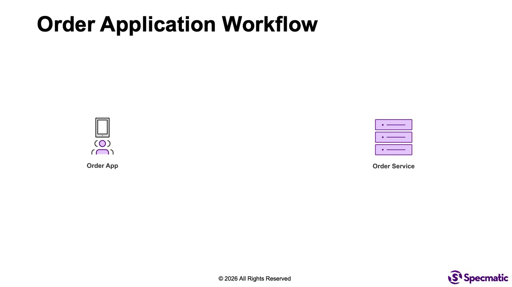
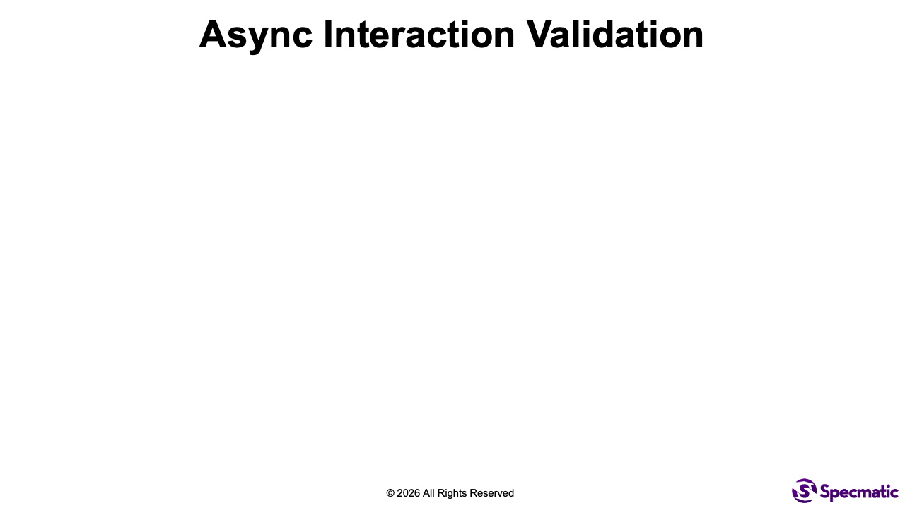

# Testing Event Flows and Behaviors

Testing event-driven systems is fundamentally harder than testing REST APIs. Validating schemas is straightforward, but validating behavior in terms of what the system actually does when it receives or produces an event is still a major challenge. Teams often struggle to trigger their systems reliably, observe side effects, and automate end-to-end event flow testing without custom scripts or brittle harnesses.

This sample project demonstrates how to validate an event flow in a Kafka-based system using Specmatic Enterprise. It includes a simple Spring Boot application that listens to messages on a Kafka topic, processes them, and then publishes a reply message to another topic. It also handles notification and update events. The contract tests validate the behavior of these event flows using Specmatic's contract testing capabilities.

Here we are using [AsyncAPI 3.0.0 specification](https://www.asyncapi.com/docs/reference/specification/v3.0.0).

## Background

This project includes a consumer (`OrderService`) that implements the following behavior:
* listens to messages on `new-order` topic and then upon receiving a message, it processes the same and publishes a reply message to `wip-order` topic. Thereby it demonstrates the [request reply pattern](https://www.asyncapi.com/docs/tutorials/getting-started/request-reply) in AsyncAPI 3.0.0 specification.
* on receiving an update (via RESTful API call) from the `WarehouseService`, the `OrderService` updates the order status to `accepted` and publishes a message on `accepted-orders` topic. Thereby it demonstrates the event notification pattern.
* on receiving a message on the `out-for-delivery-orders` topic from the `Shipping App`, the `OrderService` updates the order status to `shipped` and triggers the `TaxService` to generate a tax invoice. Thereby it demonstrates the fire-and-forget pattern.



## Time required to complete this lab:
10-15 minutes.

## Objective
Start with two failing contract tests, then fix the missing `before` fixture and repair the incorrect `after` fixture so the full async suite passes.

## Prerequisites
- Docker is installed and running.
- You are in `labs/async-event-flow`.

## Lab Rules
- Edit only `examples/async-order-service/acceptOrder.json` and `examples/async-order-service/outForDeliveryOrder.json`.
- Do not edit `specs/async-order-service.yaml`, `specmatic.yaml`, or `docker-compose.yaml`.

## How to test these event flows

Specmatic solves event-flow testing by combining:
1. **Contract validation** from `specs/async-order-service.yaml` (topics, payload schemas, headers, request-reply mappings).
2. **Scenario examples** from `examples/async-order-service/*.json` that describe concrete interactions and expected behavior.

In this sample, each example acts like an executable test case:
- `receive`: the input event Specmatic publishes to Kafka (for consumer flows).
- `send`: the output event Specmatic expects your app to publish.
- `before`: a setup fixture that runs before assertion of the scenario.
- `after`: a verification fixture that runs after the event flow is triggered, used to assert side effects.

This lab is intentionally seeded with two broken examples:
- `acceptOrder.json` is missing its `before` fixture, so the app never receives the HTTP trigger that should publish `accepted-orders`.
- `outForDeliveryOrder.json` includes an incorrect `after` fixture assertion, so the shipping flow fails until the expected TaxService verification count is corrected.

### How contract tests validate behavior (not just shape)

For request-reply style flows (for example `newOrder.json`), Specmatic:
1. sends a `receive` event on `new-orders`,
2. waits for your service to process it,
3. verifies a corresponding `send` event appears on `wip-orders` with matching payload and headers.

This ensures the event contract is honored end-to-end, including correlation headers and transformed payload values.

### `before` fixture (arrange/setup)

`before` is the setup fixture used to establish preconditions. In `acceptOrder.json`, `before` triggers an HTTP `PUT /orders` so the app performs the action that should publish the `accepted-orders` event. Specmatic then validates that app correctly published the `send` event on the expected topic as per the asyncapi spec.

Use `before` when your event is produced as a side effect of some trigger (REST call, seed action, prerequisite state).

### `after` fixture (assert side effects)

`after` is the verification fixture used for post-conditions. In `outForDeliveryOrder.json`, after publishing the correct event on the Kafka topic, Specmatic:
- checks `GET /orders/456?status=SHIPPED` returns the updated stored status of the order, and
- checks the TaxService mock verification endpoint to confirm the invoice call happened (`exampleId=tax-invoice-for-order-456`).

Use `after` when correctness depends on side effects beyond one output topic (DB state, downstream HTTP calls, idempotency outcomes).

Together, `receive`/`send` plus `before`/`after` fixtures let you express full event behavior as contract-driven scenarios, without writing custom test harness code.



## Run the contract tests using Specmatic Studio
1. Start Kafka, the sample service, and Specmatic Studio.
```shell
docker compose up
```
   
2. Open the [specmatic.yaml](specmatic.yaml) file from the left sidebar, and click on the "Run Suite" button to run the tests against the service.

You should first see 2 passing tests and 2 failing tests:

```terminaloutput
Tests run: 4, Successes: 2, Failures: 2, Errors: 0
```

3. Fix the examples:
- In `examples/async-order-service/acceptOrder.json`, add the missing `before` fixture so Specmatic performs the `PUT /orders` request before checking for the `accepted-orders` event. Copy-paste this snippet above the `send` block:

```json
"before": [
  {
    "type": "http",
    "wait": "PT1S",
    "http-request": {
      "baseUrl": "http://localhost:8080",
      "path": "/orders",
      "method": "PUT",
      "headers": {
        "Content-Type": "application/json"
      },
      "body": {
        "id": 123,
        "status": "ACCEPTED",
        "timestamp": "2025-04-12T14:30:00Z"
      }
    },
    "http-response": {
      "status": 200
    },
    "timeout": "PT30S"
  }
],
```
- In `examples/async-order-service/outForDeliveryOrder.json`, fix the `after` fixture so we expect the TaxService example to be invoked once instead of twice.

4. Re-run the suite from Studio.

You should now see:

```terminaloutput
Tests run: 4, Successes: 4, Failures: 0, Errors: 0
```

5. Bring down the Kafka broker after the tests are done.
```shell
docker compose down -v
```

## Troubleshooting

If the suite does not start, retry after pulling the latest images:
```shell
docker compose pull
```