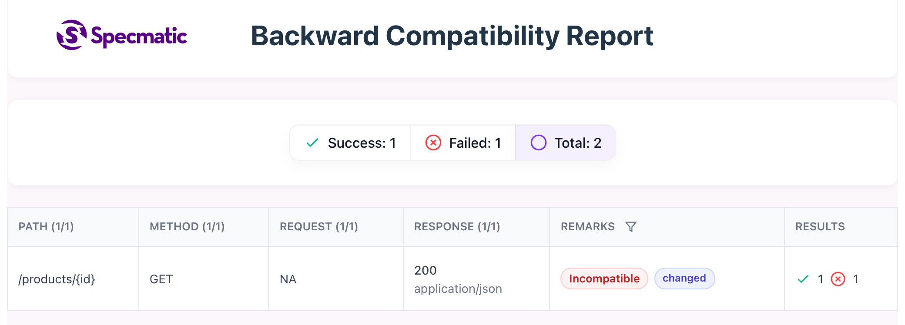
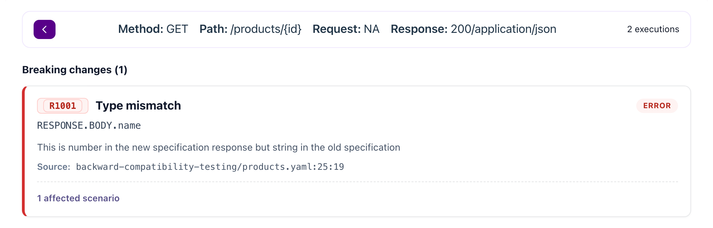
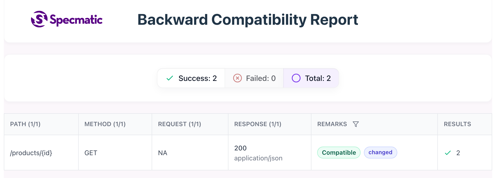

<!---
test_counts: false
--->

# Backward Compatibility Testing

## Objective
Use Specmatic's `backward-compatibility-check` command to catch a breaking API contract change before it is committed.

## Why this lab matters
Backward compatibility checks shift API governance left:
1. The git-tracked contract on `origin/main` is your baseline.
2. Your uncommitted change is the proposed API evolution.
3. Specmatic compares the two and flags breaking changes immediately.

This helps teams detect consumer-impacting contract changes during design and code review, instead of during regression testing or after release.

## Time required to complete this lab
10-15 minutes.

## Prerequisites
- Docker is installed and running.
- Git is installed.
- You are in `labs/backward-compatibility-testing`.

## Backward Compatibility Overview Video
[](https://www.youtube.com/watch?v=MYEv94ldfGY)

## Files in this lab
- `products.yaml` - The baseline OpenAPI contract already tracked in git.

## Architecture
- The tracked contract on `origin/main` is the old contract version.
- Your local edit to `products.yaml` is the proposed new contract version.
- Specmatic compares the edited file to the git-tracked baseline and reports compatibility.

## Learner task
Keep the newly added `category` field, but make the contract backward compatible again by fixing the type of `name` in `products.yaml`.

## Lab Rules
- Edit only `products.yaml`.

## Specmatic references
- Backward compatibility overview: [https://docs.specmatic.io/contract_driven_development/backward_compatibility](https://docs.specmatic.io/contract_driven_development/backward_compatibility)
- Backward compatibility rules: [https://docs.specmatic.io/contract_driven_development/backward_compatibility_rules](https://docs.specmatic.io/contract_driven_development/backward_compatibility_rules)

## Part A: Create the intentional breaking change
`products.yaml` currently matches the git-tracked baseline. Edit it so the new version becomes backward incompatible.

**Step 1:** First, update the version number at the top of the file:

```yaml
info:
  version: 1.0.0
```

to:

```yaml
info:
  version: 1.1.0
```

**Step 2:** Next, find the `GET /products/{id}` endpoint and locate its `200` response. Look for the `properties:` section that defines the response fields. You'll see:

```yaml
properties:
  name:
    type: string
  sku:
    type: string
```

**Step 3:** Make these changes to the `properties:` section:
- Change `name` from `type: string` to `type: number` (this creates the breaking change)
- Add a new `category` field with `type: string`

After your changes, the `properties:` section should look like:

```yaml
properties:
  name:
    type: number
  sku:
    type: string
  category:
    type: string
```

You now have an uncommitted change in a tracked contract file. Specmatic will compare it to the version on `origin/main`.

Alternatively, apply all three edits with a single command. It bumps the version, changes `name` to `number`, and adds the `category` field:

```shell
docker run --rm --entrypoint sh -v "${PWD}:/workspace" -w /workspace specmatic/enterprise:latest -lc "sed -i 's/version: 1.0.0/version: 1.1.0/' products.yaml; sed -i '/properties:/,/sku:/s/type: string/type: number/' products.yaml; sed -i '/^                  sku:$/i\\                  category:\\n                    type: string' products.yaml"
```

## Part B: Run the backward compatibility check
Run:

*Unix/Mac:
```shell
docker run --rm \
  --user "$(id -u):$(id -g)" \
  -v "${PWD}/..:/workspace" \
  -v "${PWD}/../license.txt:/specmatic/specmatic-license.txt:ro" \
  -w /workspace \
  specmatic/enterprise:latest \
  backward-compatibility-check \
  --base-branch origin/main \
  --target-path backward-compatibility-testing/products.yaml
```
### The console output
The check fails (exit code 1) and followed by the verdict:

```terminaloutput
Verdict for spec /workspace/backward-compatibility-testing/products.yaml:
(INCOMPATIBLE) This spec contains breaking changes to the API
```

Expected failure highlights: The breaking change appears in the incompatibility report:

```terminaloutput
The Incompatibility Report:

  In scenario "Get product by id. Response: Product details"
  API: GET /products/(id:number) -> 200

    >> RESPONSE.BODY.name (backward-compatibility-testing/products.yaml:25:19)

        This is number in the new specification response but string in the old specification
```

Windows PowerShell single-line:
```powershell
docker run --rm --user "$(id -u):$(id -g)" -v "$((Resolve-Path ..).Path):/workspace" -v "$((Resolve-Path ..\license.txt).Path):/specmatic/specmatic-license.txt:ro" -w /workspace specmatic/enterprise:latest backward-compatibility-check --base-branch origin/main --target-path backward-compatibility-testing/products.yaml
```

```terminaloutput
Verdict for spec /workspace/backward-compatibility-testing/products.yaml:
(INCOMPATIBLE) This spec contains breaking changes to the API
```

Why the command is structured this way:
- `-v "${PWD}/..:/workspace"` mounts the `labs` repository root, not just this lab folder, so Specmatic can access the git repository metadata.
- `--user "$(id -u):$(id -g)"` runs the container as your host user, which avoids git ownership issues when the mounted repository is inspected inside the container.
- `--base-branch origin/main` tells Specmatic which tracked baseline to compare against.
- `--target-path backward-compatibility-testing/products.yaml` tells Specmatic to compare the working tree version of this file with the tracked version on `origin/main`.

### Read the HTML report
After the run, open this file in your browser. It is written to the `build/` directory: [build/reports/specmatic/backward_compatibility/html/index.html](build/reports/specmatic/backward_compatibility/html/index.html)

The landing page lists every operation that was checked, each with a compatibility status. Here `GET /products/{id}` is flagged **Incompatible**:



Click that operation to see exactly what broke:



Read the breaking-change card top to bottom:
- **`R1001` Type mismatch** — the backward compatibility rule that was violated, with a short title. Click the rule ID to open its [reference](https://docs.specmatic.io/rules).
- **ERROR** — the severity of the change.
- **`RESPONSE.BODY.name`** — the breadcrumb: where the change sits within the request or response. Here, the `name` field of the response body.
- *This is number in the new specification response but string in the old specification* — a plain-English description of the breaking change.
- **`Source: backward-compatibility-testing/products.yaml:25:19`** — the exact file, line, and column of the change, so you can jump straight to it instead of scanning the whole spec.

Why this fails:
- Adding optional `category` is safe.
- Changing `name` from `string` to `number` is a breaking change for existing consumers.

## Part C: Fix the contract and re-run
Open `products.yaml`.

Under the `200` response schema for `GET /products/{id}`, change:

```yaml
name:
  type: number
```

to:

```yaml
name:
  type: string
```

Keep the new `category` field, and keep version `1.1.0`.

Alternatively, apply that fix with a single command:

```shell
docker run --rm --entrypoint sh -v "${PWD}:/workspace" -w /workspace specmatic/enterprise:latest -lc 'sed -i "/properties:/,/sku:/s/type: number/type: string/" products.yaml'
```

## Part D: Re-run the check
Run the same command again:

*Unix/Mac:
```shell
docker run --rm \
  --user "$(id -u):$(id -g)" \
  -v "${PWD}/..:/workspace" \
  -v "${PWD}/../license.txt:/specmatic/specmatic-license.txt:ro" \
  -w /workspace \
  specmatic/enterprise:latest \
  backward-compatibility-check \
  --base-branch origin/main \
  --target-path backward-compatibility-testing/products.yaml
```

### The console output
This time the check passes (exit code 0). The terminal shows the passing verdict:

```terminaloutput
Verdict for spec /workspace/backward-compatibility-testing/products.yaml:
  (COMPATIBLE) The spec is backward compatible with the corresponding spec from origin/main
```

Windows PowerShell single-line:
```powershell
docker run --rm --user "$(id -u):$(id -g)" -v "$((Resolve-Path ..).Path):/workspace" -v "$((Resolve-Path ..\license.txt).Path):/specmatic/specmatic-license.txt:ro" -w /workspace specmatic/enterprise:latest backward-compatibility-check --base-branch origin/main --target-path backward-compatibility-testing/products.yaml
```

```terminaloutput
Verdict for spec /workspace/backward-compatibility-testing/products.yaml:
  (COMPATIBLE) The spec is backward compatible with the corresponding spec from origin/main
```

### Read the HTML report
Open the report again [build/reports/specmatic/backward_compatibility/html/index.html](build/reports/specmatic/backward_compatibility/html/index.html)

`GET /products/{id}` is now flagged **Compatible**. Adding the optional `category` field is a safe, additive change, so existing consumers are unaffected:



## Clean up
Restore the tracked file:

```shell
git restore products.yaml
```

## Check backward compatibility in Specmatic Studio before saving
Start Studio from `labs/backward-compatibility-testing`:

```shell
docker compose --profile studio up
```

Open [Specmatic Studio](http://127.0.0.1:9000/_specmatic/studio), then:
1. Hover the small chevron on the left edge to open the file tree.
2. Open `products.yaml`.
3. Switch to the **Spec** tab.
4. Make the same breaking changes described in Part A.
5. Before saving the file, click the **Test Backward Compatibility** check button on the **Spec** tab.

Expected Studio behavior:
- Studio checks the edited in-memory spec against the saved file, even before you save the file.
- The check should report the same incompatibility for `RESPONSE.BODY.name`.
- This lets you validate the impact of the change before you save it to disk.

After observing the failure:
1. Change `name` back to `string`.
2. Keep `category` and version `1.1.0`.
3. Click the **Test Backward Compatibility** check button again.
4. Confirm the check passes.
5. Save the file only after the compatibility result is what you expect.

Optional extension:
- Remove the `category` key and click the **Save** button, thus bringing the schema back to what it's original form.
- Add a `WIP` tag to the `get` operation in `products.yaml`, just under the `summary` field:
  ```yaml
  get:
    summary: Get product by id
    tags:
      - WIP
  ```
- Save the file by pressing the **Save** button.
- Now, change `name` to `number` and click the **Test Backward Compatibility** button.
- It's the same breaking change as before, but now you can confirm that the check is not affected by the presence of an additional tag in the operation.
- Since we have marked the operation as **WIP**, Specmatic knows that it is not yet finalized, and hence the backward compatibility check will not fail despite breaking changes.
- Try a different additive change, such as adding another optional response field, and confirm that the check still passes.

Clean up:

```shell
docker compose --profile studio down -v
```

What was verified in Studio:
- Opening `products.yaml` from the left file tree activates the live screen for this file.
- The **Test Backward Compatibility** button on the **Spec** tab sends the current unsaved editor content for validation.
- A breaking unsaved edit returns the expected incompatibility.
- Fixing the unsaved edit and running the check again returns a passing result.

## Common confusion points
- Running the command from another directory. The README assumes you are in `labs/backward-compatibility-testing`.
- Expecting Specmatic to compare two arbitrary files. In this lab it compares your working tree change to the tracked version on `origin/main`.
- Mounting only the current folder into Docker. Specmatic needs the `labs` repo root mounted so git metadata is available inside the container.
- In Studio, saving first and checking later. For this workflow, use the **Test Backward Compatibility** check button on the **Spec** tab before saving.

## What you learned
- Backward compatibility can be validated directly from API specifications.
- Specmatic uses git history to compare your proposed contract change against the tracked baseline on `origin/main`.
- Safe additive changes pass, while consumer-breaking schema changes are flagged before merge.

## Next step
If you are doing this lab as part of an eLearning course, return to the eLearning site and continue with the next module.
