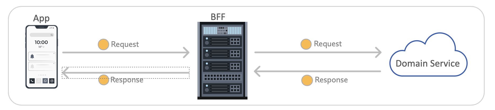

# Running Contract Tests and Mocks in CI

## Objective
Understand how a central contract repo, a consumer pipeline, and provider pipelines fit together in CI, then run a fail-first simulation of the contract-repo PR gate locally.

## Why this lab matters
In teams that develop and deploy their services/compoents independently, contract mismatches usually show up late in the integration phase:
- a provider changes a request or response shape and breaks an existing consumer
- a consumer waits on an unavailable dependency or an unstable test environment
- a contract evolves without anyone noticing that it is no longer backward compatible

Integrating Specmatic into CI shifts these checks earlier, into the pull request and build pipeline:
1. Contract changes are validated before merge.
2. Consumers can test against stable virtualized dependencies using `specmatic mock`.
3. Providers can verify real implementations against the contract using `specmatic test`.
4. Teams can publish build reports to Specmatic Insights after merge to govern their API ecosystem and track quality across repos and pipelines.

In practice, this means teams get fast feedback at the point of change instead of discovering integration failures later in shared environments or production.

This lab uses the same CI topology:
1. A central contract repo validates specs before merge.
2. Consumer pipelines virtualize their dependencies with `specmatic mock`.
3. Provider pipelines run `specmatic test` against real implementations.
4. After code is merged, only builds on the default branch should run `send-report` to publish reports to Specmatic Insights.

This lab keeps the architecture complete, but the hands-on exercise focused:
- you will run only the contract-repo gate locally
- you will inspect the consumer/provider workflow examples rather than execute all of them

## Time required to complete this lab
15-20 minutes.

## Prerequisites
- Docker is installed and running.
- You are in `labs/continuous-integration`.

## Architecture



- `contracts/order_bff.yaml` represents the BFF contract consumed by a client app.
- `contracts/order_api.yaml` represents the provider contract consumed by the BFF.
- `docker-compose.yaml` runs a portable CI simulator for the central contract repo checks.
- `workflows/github/` contains ready-made GitHub Actions examples for:
  - central contract repo checks
  - client pipeline with BFF virtualization
  - BFF pipeline with domain API virtualization and contract tests
  - provider pipeline with contract tests
- Each workflow example also shows the post-merge `send-report` step used by Specmatic Insights.

## Files in this lab
- `contracts/order_bff.yaml` - BFF-facing OpenAPI contract.
- `contracts/order_api.yaml` - domain API OpenAPI contract with one intentional backward-incompatible change.
- `contracts/order_bff_examples/` - valid external examples for the BFF contract.
- `contracts/order_api_examples/` - valid external examples for the domain API contract.
- `baseline/contracts/` - committed baseline used by the CI simulator for backward compatibility comparison.
- `.spectral.yaml` - Spectral ruleset used by the local PR gate simulation.
- `ci-runner/Dockerfile` - portable runner image with Git, Java, Node, Spectral, and Specmatic CLI.
- `ci-runner/run-contract-repo-ci.sh` - simulates the central contract repo PR gate.
- `workflows/github/*.yaml` - inspectable GitHub Actions examples for the full CI topology.
- `workflows/specmatic/*.yaml` - config-first Specmatic files used by the workflow samples for `mock`, `test`, and report output settings.

## Learner task
Make the local contract-repo CI simulation pass by fixing the backward-incompatible change in `contracts/order_api.yaml`.

## Lab Rules
- Edit only `contracts/order_api.yaml`.
- Do not edit `contracts/order_bff.yaml`.
- Do not edit anything in `contracts/order_bff_examples/` or `contracts/order_api_examples/`.
- Do not edit `docker-compose.yaml`, `.spectral.yaml`, `ci-runner/`, or `workflows/github/`.

## Specmatic references
- Continuous Integration: [https://docs.specmatic.io/references/continuous_integration](https://docs.specmatic.io/references/continuous_integration)
- External examples validation: [https://docs.specmatic.io/features/external_examples.html](https://docs.specmatic.io/features/external_examples.html)
- Insights onboarding: [https://docs.specmatic.io/enterprise_onboarding/insights](https://docs.specmatic.io/enterprise_onboarding/insights)

## Part A: Run the local contract-repo CI simulation
Run:

```shell
docker compose up contract-repo-ci --build --abort-on-container-exit
```

What this command does:
- builds the portable CI runner image
- lints the contracts with Spectral
- validates external examples with Specmatic
- simulates a PR check by comparing the current `contracts/order_api.yaml` against a baseline committed on a temporary local `main` branch

Expected behavior:
- Spectral lint passes.
- Example validation passes for both specs.
- Backward compatibility check fails.

Expected failure highlight:

```terminaloutput
(INCOMPATIBLE) This spec contains breaking changes to the API
```

Why this fails:
- `priority` already exists as an optional request field.
- In the current working copy of `contracts/order_api.yaml`, `priority` has been added to the request body's `required` list.
- That is a breaking change for existing consumers, even though the examples still remain valid.

Clean up after each run:

```shell
docker compose down -v
```

## Part B: Fix the contract
Open `contracts/order_api.yaml`.

Find this block under `POST /orders`:

```yaml
required:
  - productId
  - quantity
  - priority
```

Change it to:

```yaml
required:
  - productId
  - quantity
```

Keep:
- version `1.1.0`
- the `priority` property itself

Do not change anything else.

## Part C: Re-run the CI simulation
Run the same command again:

```shell
docker compose up contract-repo-ci --build --abort-on-container-exit
```

Expected passing behavior:
- Spectral lint passes.
- Example validation passes for both specs.
- Backward compatibility check passes.

Expected passing highlight:

```terminaloutput
(COMPATIBLE) The spec is backward compatible
```

Clean up:

```shell
docker compose down -v
```

## Part D: Inspect the GitHub Actions examples
Open the workflow files in `workflows/github/` and identify the role of each pipeline:

1. `01-contract-repo-ci.yaml`
   - runs `spectral lint`
   - runs `specmatic examples validate`
   - runs `specmatic backward-compatibility-check` against `origin/${DEFAULT_BRANCH}`, where `DEFAULT_BRANCH` comes from the repository metadata in GitHub Actions
2. `02-client-ci.yaml`
   - starts `specmatic mock` from `workflows/specmatic/client/specmatic.yaml`
   - runs client tests against the virtualized BFF
3. `03-bff-ci.yaml`
   - starts `specmatic mock` from `workflows/specmatic/order-api-mock/specmatic.yaml`
   - runs `specmatic test` from `workflows/specmatic/bff/specmatic.yaml`
4. `04-order-api-ci.yaml`
   - starts the provider
   - runs `specmatic test` from `workflows/specmatic/order-api/specmatic.yaml`

In all four files, also locate:
- the step that writes the Specmatic license key to `~/.specmatic/specmatic-license.txt`
- the `send-report` step
- the default-branch gate that keeps Insights publishing to merge or push builds on the repository's main/default branch only, not on pull requests

Insights note:
- This lab does not require you to execute `send-report`.
- If your team already has a valid Specmatic CI license key, these workflow files show exactly where the Insights integration fits after merge to the default branch.

## Troubleshooting
- If the build uses stale layers after an edit, rerun with `--build` exactly as documented.
- If Docker build fails while installing npm packages, retry once in case of transient network issues.
- If the first run passes unexpectedly, confirm `contracts/order_api.yaml` still includes `priority` in the request `required` list.
- If you inspect the workflow files and do not see `send-report`, you are likely looking at the wrong file under `workflows/github/`.

## What you learned
- A central contract repo can enforce pre-merge quality gates before application code pipelines run.
- Consumer CI uses `specmatic mock` to isolate dependencies.
- Provider CI uses `specmatic test` to verify implementations against contracts.
- Some services, like BFF, can be both consumers and providers, and thus have both mock and test in their CI.
- Specmatic Insights is typically a post-merge reporting step added after the build and test steps complete on the default branch.
