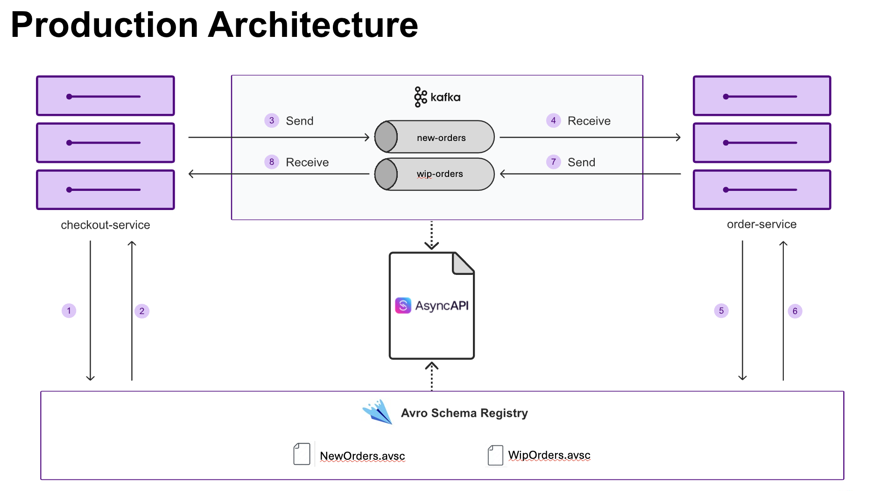

# Contract Testing with AsyncAPI and Avro Schema Registry

This lab shows a common event-driven drift problem: the service already enforces some input validations, but those rules are still implicit in code instead of being captured in the contract artifacts that other teams rely on.

Your job is to make those hidden rules explicit in the Avro schemas and then update the AsyncAPI examples so the contract tests describe valid business messages end to end.

## Objective

Run the async contract tests, observe the intentional failure, update the Avro schemas and examples, and verify a passing run.

## Time required to complete this lab

15-20 minutes.

## Prerequisites

- Docker is installed and running.
- You are in `labs/kafka-avro`.
- Ports `2181`, `8080`, `8085`, and `9092` are free.

## AsyncAPI and Avro Overview Video
[](https://www.youtube.com/watch?v=c4KQVcKoFCU)

## Files in this lab

- `docker-config/avro/NewOrders.avsc` - Avro schema for messages published to `new-orders`
- `docker-config/avro/WipOrders.avsc` - Avro schema for messages published to `wip-orders`
- `.specmatic/repos/labs-contracts/asyncapi/kafka-avro/order-service-async-avro-v3_0_0.yaml` - AsyncAPI contract that references schemas from Schema Registry
- `api-specs/order-service-async-avro-v3_0_0_examples/` - externalized examples used as executable async tests
- `specmatic.yaml` - Specmatic async test configuration
- `docker-compose.yaml` - Kafka, Schema Registry, application, and Specmatic test runner

## Lab Rules

- Do not edit: the contract in `.specmatic/repos/labs-contracts/asyncapi/kafka-avro/order-service-async-avro-v3_0_0.yaml`, `specmatic.yaml`, `docker-compose.yaml`.
- Edit only:
  - `docker-config/avro/NewOrders.avsc`
  - `docker-config/avro/WipOrders.avsc`
  - `api-specs/order-service-async-avro-v3_0_0_examples/PLACE_IPHONE_ORDER.json`
  - `api-specs/order-service-async-avro-v3_0_0_examples/PLACE_MACBOOK_ORDER.json`
- Do not change any other file. In this lab, the contract artifacts are the source of truth you need to fix.

## Architecture mental model



- Contract test runner: `specmatic-test`
- Provider under test: `order-service`
- Supporting components: Kafka broker plus Schema Registry

Flow:
1. Specmatic reads the AsyncAPI spec and resolves Avro schemas from Schema Registry.
2. Specmatic publishes the `receive` example message to the `new-orders` topic.
3. `order-service` consumes the message and applies its built-in validations.
4. Only valid messages are transformed and published to `wip-orders`.
5. Specmatic waits for and validates the `send` message on `wip-orders`.

Why the baseline fails:
- The starter `.avsc` files are too permissive.
- The starter examples use values that violate validations already enforced by `order-service`.
- Because the service rejects those messages, no reply is published on `wip-orders`, and the contract tests time out.

## Run the baseline and observe the failure

Pull images first:

```shell
docker compose pull
```

Run the async contract tests:

```shell
docker compose up specmatic-test --abort-on-container-exit
```

Expected failure signal:

```terminaloutput
Timeout waiting for a message on topic 'wip-orders'.
Refer to Message Count Report to verify the message counts on different topics.

Tests run: 2, Successes: 0, Failures: 2, Errors: 0
```

The message count report should show:

```terminaloutput
| topic      | Actual | Expected |
| new-orders |    2   |    2     |
| wip-orders |    0   |    2     |
```

Clean up before making changes:

```shell
docker compose down -v --remove-orphans
```

## Learner task

Update the contract artifacts so they reflect the validations already implemented in the service.

You need to do two things:
1. Add the missing constraints to the Avro schemas so invalid payloads are rejected by contract, so we don't rely on hidden service logic.
2. Update both example messages so their values satisfy those constraints.

Focus on the fields that currently drift from service behavior:
- order `id`
- `orderItems[].name`
- `orderItems[].price`

## Fix path

### Step 1: Update the Avro schemas

In `docker-config/avro/NewOrders.avsc` and `docker-config/avro/WipOrders.avsc`, add the missing validation constraints so the schemas describe the service's real expectations.

Replace `docker-config/avro/NewOrders.avsc` with:

```json
{
  "type": "record",
  "name": "OrderRequest",
  "namespace": "order",
  "fields": [
    {
      "name": "id",
      "type": "int",
      "x-minimum": 1,
      "x-maximum": 100
    },
    {
      "name": "orderItems",
      "type": {
        "type": "array",
        "items": {
          "type": "record",
          "name": "Item",
          "fields": [
            { "name": "id", "type": "int" },
            {
              "name": "name",
              "type": "string",
              "x-minLength": 2,
              "x-maxLength": 10,
              "x-regex": "^[A-Za-z]{2,10}$"
            },
            { "name": "quantity", "type": "int" },
            {
              "name": "price",
              "type": "int",
              "x-minimum": 1000
            }
          ]
        }
      }
    }
  ]
}
```

Note all the x- constraints added to `id`, `name`, and `price` fields.

Replace `docker-config/avro/WipOrders.avsc` with:

```json
{
  "type": "record",
  "name": "OrderToProcess",
  "namespace": "order",
  "fields": [
    {
      "name": "id",
      "type": "int",
      "x-minimum": 1,
      "x-maximum": 100
    },
    {
      "name": "status",
      "type": {
        "type": "enum",
        "name": "OrderStatus",
        "symbols": ["PENDING", "PROCESSING", "COMPLETED", "CANCELLED"]
      }
    }
  ]
}
```

### Step 2: Update the examples

In both files under `api-specs/order-service-async-avro-v3_0_0_examples/`, replace the current invalid values with values that satisfy the new schema constraints.

Keep the overall flow the same:
- `receive.topic` stays `new-orders`
- `send.topic` stays `wip-orders`
- `status` stays `PROCESSING`

Replace `api-specs/order-service-async-avro-v3_0_0_examples/PLACE_IPHONE_ORDER.json` with:

```json
{
  "name": "PLACE_IPHONE_ORDER",
  "receive": {
    "topic": "new-orders",
    "key": 1,
    "payload": {
      "id": 1,
      "orderItems": [
        {
          "id": 1,
          "name": "iPhone",
          "quantity": 10,
          "price": 5000.00
        }
      ]
    }
  },
  "send": {
    "topic": "wip-orders",
    "key": 1,
    "payload": {
      "id": "$match(exact:1)",
      "status": "$match(exact:PROCESSING)"
    }
  }
}
```

Replace `api-specs/order-service-async-avro-v3_0_0_examples/PLACE_MACBOOK_ORDER.json` with:

```json
{
  "name": "PLACE_MACBOOK_ORDER",
  "receive": {
    "topic": "new-orders",
    "key": 2,
    "payload": {
      "id": 2,
      "orderItems": [
        {
          "id": 1,
          "name": "Macbook",
          "quantity": 50,
          "price": 6000.00
        }
      ]
    }
  },
  "send": {
    "topic": "wip-orders",
    "key": 2,
    "payload": {
      "id": "$match(exact:2)",
      "status": "$match(exact:PROCESSING)"
    }
  }
}
```

## Verify the fix

Re-run the contract tests:

```shell
docker compose up specmatic-test --abort-on-container-exit
```

Expected passing output:

```terminaloutput
Tests run: 2, Successes: 2, Failures: 0, Errors: 0
```

The message count report should now show:

```terminaloutput
| topic      | Actual | Expected |
| new-orders |    2   |    2     |
| wip-orders |    2   |    2     |
```

Clean up:

```shell
docker compose down -v --remove-orphans
```

## What changed and why

The service behavior did not need fixing. The contract artifacts were incomplete.

By moving those rules into the `.avsc` files and aligning the executable examples with them, you:
- document the true message constraints in shared contract artifacts,
- ensure Schema Registry carries those rules,
- make the examples realistic and executable,
- prevent future teams from publishing values the service will silently reject.

## Troubleshooting

- `port is already allocated`:
  Free ports `2181`, `8080`, `8085`, and `9092`, then retry.
- `Timeout waiting for a message on topic 'wip-orders'` even after your edits:
  Bring the stack down with `docker compose down -v --remove-orphans` and run again so schemas are re-registered from your updated `.avsc` files.
- Schema registration errors:
  Check that the `.avsc` files still contain valid JSON after your edits.
- Shell script errors on Windows:
  Ensure `docker-config/create-topics.sh` and `docker-config/avro/register-schemas.sh` use LF line endings, not CRLF.

## Optional extension

- Add one more example that should pass under the same constraints.
- Intentionally introduce a bad example and observe whether the failure happens at schema validation time or behavior verification time.

## Next step
If you are doing this lab as part of an eLearning course, return to the eLearning site and continue with the next module.
