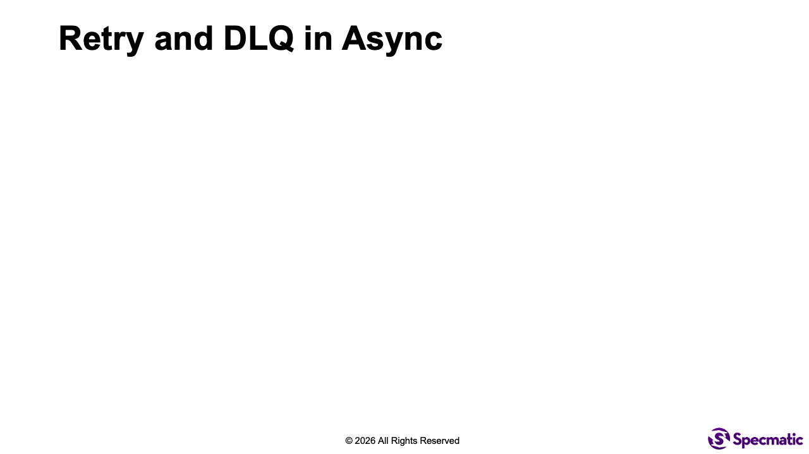

# Kafka to SQS Retry and DLQ

This lab shows a common async implementation drift problem: the AsyncAPI contract already describes retry and dead-letter behavior, but the service does not fully handle the retry and DLQ behavior.

Your job is to fix the service so it matches the retry and DLQ behavior already described in the contract and examples.

## Objective

Run the async contract tests, observe the intentional failure, update the Python provider so it handles retry and DLQ correctly, and verify a passing run.

## Time required to complete this lab

15-20 minutes.

## Prerequisites

- Docker is installed and running.
- You are in `labs/kafka-sqs-retry-dlq`.
- Ports `4566`, `9092`, `9000`, and `9001` are free.

## Files in this lab

- `spec/order-service-sqs-kafka.yaml` - AsyncAPI contract that already declares success, retry, and DLQ behavior
- `spec/order-service-sqs-kafka_examples/` - externalized examples for success, retry-success, retry-to-DLQ, and direct-to-DLQ flows
- `service/app.py` - Python provider implementation with an intentional retry bug
- `specmatic.yaml` - Specmatic async test configuration
- `docker-compose.yaml` - LocalStack, Kafka, provider, contract test runner, and optional Studio

## Lab Rules

- Do not edit: `spec/order-service-sqs-kafka.yaml`, `specmatic.yaml`, `docker-compose.yaml`, or any file under `spec/order-service-sqs-kafka_examples/`.
- Edit only: `service/app.py`.
- Do not change the contract or the examples. In this lab, the service behavior is incomplete and must be fixed.

## Architecture mental model



- Contract test runner: `contract-test`
- Provider under test: `provider`
- Supporting components: Kafka and LocalStack SQS

Flow:
1. Specmatic publishes a message to `place-order-topic` based on the `receive` payload in the examples.
2. The python service transforms successful messages and emits another message on the `place-order-queue`.
3. Some messages intentionally fail once, always fail, or fail non-retryably.
4. Failed messages are published to `place-order-retry-topic` or `place-order-dlq-topic`.
5. Based on the scenario, Specmatic validates if correct numbers of messages with the right schema validations have  
arrived on required channels to ensure the actual async flow matches the declared behavior in the AsyncAPI contract.

Why the baseline fails:
- The contract and examples already describe the retry and DLQ flows.
- The python service handles the normal success path and the direct-to-DLQ path.
- The retry pipeline is incomplete, so messages published to the retry topic are never reprocessed.
- Because of that, the retry-success and retry-to-DLQ scenarios fail at runtime.

## Run the baseline and observe the failure

```shell
docker compose up contract-test --build --abort-on-container-exit
```

Expected failure shape:
- The normal success scenarios pass.
- The direct-to-DLQ scenario also passes.
- The retry-success and retry-to-DLQ scenarios fail because the provider never consumes retry messages.

Preferred failure summary:

```terminaloutput
Tests run: 6, Successes: 4, Failures: 2, Errors: 0
```

The failing scenarios should be:
- `Retry_Scenario_Standard_Order`
- `Receive_Retry_DLQ_Scenario_Priority_Order`

Clean up before making changes:

```shell
docker compose down -v
```

## Learner task

Update `service/app.py` so the provider matches the retry and DLQ behavior already declared in the contract.

You need to fix one behavior:
1. retry messages published to `place-order-retry-topic` must actually be consumed and reprocessed

## Fix path

In `service/app.py`, inspect the bridge startup code.

What to look for:
- the app should start both the main consumer and the retry consumer threads
- there is a lab hint comment above the disabled retry-consumer thread
- the intended fix is to uncomment the `RetryConsumer` thread entry in `self.threads`

Do not change the contract, examples, or Compose wiring.

## Pass criteria

Re-run:

```shell
docker compose up contract-test --build --abort-on-container-exit
```

Expected passing output:

```terminaloutput
Tests run: 6, Successes: 6, Failures: 0, Errors: 0
```

The message count report should show:

```terminaloutput
| Topic/queue name        | Actual | Expected |
| place-order-topic       |   6    |    6     |
| place-order-queue       |   4    |    4     |
| place-order-retry-topic |   2    |    2     |
| place-order-dlq-topic   |   2    |    2     |
```

Clean up:

```shell
docker compose down -v
```

## Run in Studio

```shell
docker compose --profile studio up studio --build
```

Open [Studio](http://127.0.0.1:9000/_specmatic/studio), load `specmatic.yaml`, and run the suite.

Stop Studio:

```shell
docker compose --profile studio down -v
```

## Troubleshooting

- `port is already allocated`:
  Free `4566`, `9092`, `9000`, and `9001`, then retry.
- The suite still fails after fixing `app.py`:
  Bring the stack down with `docker compose down -v` and run again so Kafka and LocalStack state is reset.
- Retry scenario still never reaches SQS:
  Check that the retry consumer thread is started and polling `place-order-retry-topic`.
- First run is slow:
  The initial image pull and container startup can take longer than later runs.
