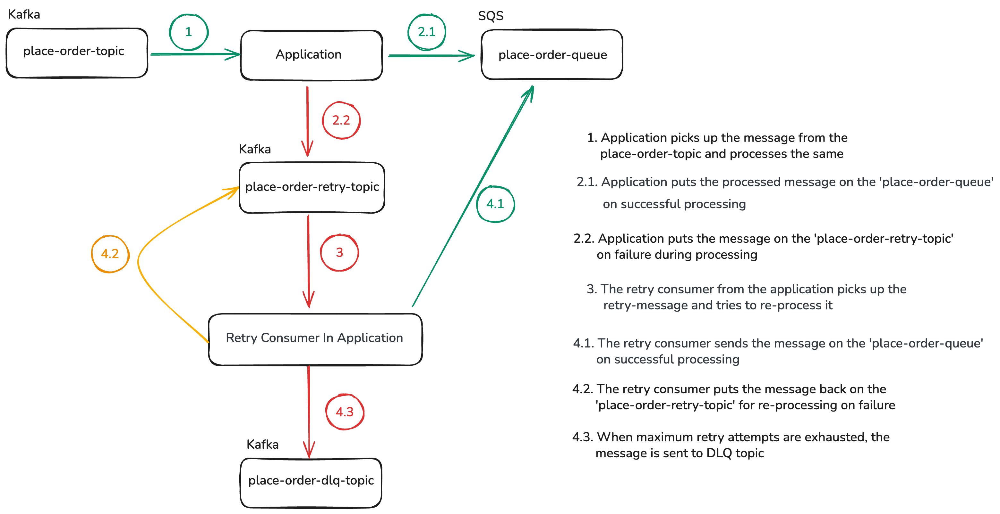

# Kafka to SQS Retry and DLQ

This lab demonstrates how Specmatic validates async Kafka to SQS pipelines that include retry and dead-letter flows.

## Objective

Run the async contract tests, observe success, retry, and DLQ scenarios being validated from the same AsyncAPI contract, and inspect how the provider propagates correlation IDs across Kafka, SQS, retry, and DLQ channels.

## Time required to complete this lab

15-20 minutes.

## Prerequisites

- Docker is installed and running.
- You are in `labs/kafka-sqs-retry-dlq`.
- Ports `4566`, `9092`, `9000`, and `9001` are free.

## Files in this lab

- `spec/order-service-sqs-kafka.yaml` - AsyncAPI contract with success, retry, and DLQ semantics
- `spec/order-service-sqs-kafka_examples/` - Executable examples for normal, retry-success, retry-to-DLQ, and direct-to-DLQ flows
- `service/app.py` - Python Kafka-to-SQS bridge and retry consumer
- `specmatic.yaml` - Specmatic async test configuration
- `docker-compose.yaml` - LocalStack, Kafka, provider, contract test runner, and optional Studio
- `create-topics.sh` - Kafka topic bootstrap script

## Architecture mental model



- Contract test runner: `contract-test`
- Provider under test: `provider`
- Supporting components: Kafka and LocalStack SQS

Flow:
1. Specmatic publishes a `receive` message to `place-order-topic`.
2. The provider transforms the message and usually sends the transformed payload to SQS.
3. For configured order IDs, the provider intentionally fails transformation once, repeatedly, or non-retryably.
4. Failed messages are published to `place-order-retry-topic` and reprocessed with exponential backoff.
5. Exhausted or non-retryable messages are published to `place-order-dlq-topic`.
6. Specmatic validates the expected `send`, `retry`, and `dlq` events from the contract examples.

## Intentional failure scenarios in the provider

The provider enables three built-in demo cases through environment variables:

- `ORD-RETRY-90001` fails once, then succeeds from the retry topic
- `ORD-DLQ-90001` keeps failing until it reaches the DLQ topic
- `ORD-RECEIVE-DLQ-90001` skips retry and goes straight to the DLQ topic

This gives you a passing test suite while still demonstrating failure-handling behavior.

## Run the contract suite

```shell
docker compose up contract-test --build --abort-on-container-exit
```

Expected pass signal:

```terminaloutput
Tests run: 6, Successes: 6, Failures: 0, Errors: 0
```

Clean up:

```shell
docker compose down -v
```

## Run in Studio

```shell
docker compose --profile studio up studio --build
```

Open [Studio](http://127.0.0.1:9000/_specmatic/studio), load `specmatic.yaml`, and run the suite.

Stop Studio:

```shell
docker compose --profile studio down -v
```

## Extension tasks

- Change `MAX_RETRIES` in `docker-compose.yaml` and observe how the DLQ example behaves.
- Disable `ENABLE_TEST_FAILURE_SCENARIOS` and see which retry and DLQ examples stop matching provider behavior.
- Edit `service/app.py` to change one transformed status and observe the contract failure location.

## Troubleshooting

- `port is already allocated`:
  Free `4566`, `9092`, `9000`, and `9001`, then retry.
- `localstack` is healthy but the queue is missing:
  Re-run with `docker compose down -v` first so the init hook is replayed.
- Contract test starts before infrastructure is warm:
  Re-run once. The test container already waits briefly, but the first image pull can still be slow.
