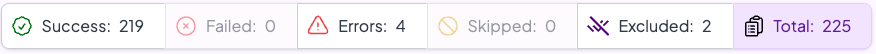

# Sample Contract Testing and API Mocking Demo

## Background
In this sample project, we will use [Specmatic](https://specmatic.io) to contract test the BFF (Backend for Frontend) in isolation. 
BFF is dependent on Domain API and Kafka. Using this sample project we'll demonstrate both OpenAPI and AsyncAPI support in Specmatic.

Following are the specifications used in this project:

* [BFF's OpenAPI spec](specs/product_search_bff_v6.yaml) is used for running contract tests against the BFF.
* [Domain API's OpenAPI spec](specs/api_order_v5.yaml) is used for stubbing the Domain API.
* [AsyncAPI spec](specs/kafka.yaml) of Kafka that defines the topics and message schema and is used for mocking interactions with Kafka.

### Application Architecture


### Contract Testing Setup


## Time required to complete this lab:
10-15 minutes.

## Prerequisites
- Docker is installed and running.
- You are in `labs/order-bff`.

## Run Contract Tests

### 1. Using Specmatic Studio (Recommended for Local Development)

```shell
docker compose --profile studio up
```
This will start the Specmatic Studio and the System Under Test (SUT) [BFF in this case] in Docker containers. 
Once the containers are up and running, open [Specmatic Studio](http://localhost:9000/_specmatic/studio) in your browser. 
In Studio, on the left sidebar, open the specmatic.yaml file and click on the "Run Suite" button to start all the dependencies as mocks and then execute the contract tests against the SUT.

When the tests complete, you should see the following in the status header indicating that the contract tests run successfully:



```shell
docker compose --profile studio down -v
```

### 2. Using Docker (Recommended for CI)
```shell
docker compose --profile test up test --abort-on-container-exit
```

In the logs, you should see the following lines indicating that the contract tests run successfully:

**Tests run: 227, Successes: 223, Failures: 0, Errors: 4**

```shell
docker compose --profile test down -v
```

Also look at the [detailed contract report](build/reports/specmatic/test/html/index.html) to see the details of the tests that were run.
