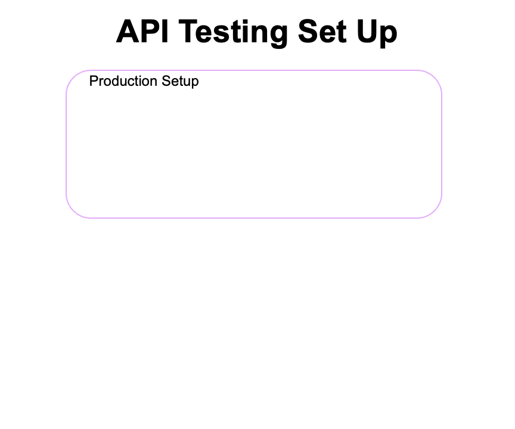

# Quick Start API Testing Lab

## Contract Testing vs API Testing
- In Contract Testing, we verify that the provider service adheres to the contract (interface), which is a formal agreement on the expected interactions.
- In API Testing, we validate the actual values of the API against specific test cases, often using real data and scenarios.

## Objective
In Specmatic, we use matchers to assert specific values in the response. This lab teaches you how to use matchers in your API test so you can assert exact response values based on your business behavior/logic.



## Why this lab matters
Real services often return a mix of stable and unstable values:
- one field may always be the same
- one field may legitimately be one of several allowed values
- one field may be generated as a fresh timestamp
- one field may follow a format without being fixed to one exact value

This lab shows how to express each of those expectations with the right matcher on the test side.

## Time required to complete this lab:
10-15 minutes.

## Prerequisites
- Docker is installed and running.
- You are in `labs/quick-start-api-testing`.

## Architecture
- `service/server.py` runs a small Python verification service.
- `specs/verification-api.yaml` defines the contract.
- `specmatic.yaml` points Specmatic at the spec and external test examples.
- `examples/*.json` contains the test requests and expected responses.

## Files in this lab
- `specs/verification-api.yaml` - OpenAPI contract for the verification service.
- `service/server.py` - Python service implementation that already satisfies the contract.
- `examples/test_finance_user_11.json` - test example you will fix using `pattern`.
- `examples/test_support_user_55.json` - test example you will fix using `dataType` and `pattern`.
- `docker-compose.yaml` - runs provider and contract tests.
- `specmatic.yaml` - Specmatic configuration.

## Lab Rules
- Do not edit `specs/verification-api.yaml`.
- Do not edit `service/server.py`.
- Do not edit `docker-compose.yaml`.
- Edit only these files:
  - `examples/test/test_finance_user_11.json`
  - `examples/test/test_support_user_55.json`

## Specmatic references
- Matchers: [https://docs.specmatic.io/features/matchers](https://docs.specmatic.io/features/matchers)
- Contract testing overview: [https://docs.specmatic.io/documentation/contract_testing.html](https://docs.specmatic.io/documentation/contract_testing.html)

## Problem context
Your verification service returns:
- `handledBy`, which is always `verification-service`
- `decision`, which may be `approved` or `verified`
- `processedOn`, which is generated at runtime
- `referenceCode`, which follows the pattern `VRF-######`

The service is already contract-compliant. The problem is in the test examples:
- one example is too strict about a valid enum value
- another example is too strict about a runtime timestamp and a patterned code
- another example is too strict about a runtime date and a patterned code

## 1. Run the baseline contract tests (intentional failure)
Run:

```shell
docker compose up api-test --build --abort-on-container-exit
```

Expected output:

```terminaloutput
Tests run: 4, Successes: 2, Failures: 2, Errors: 0
```

Clean up:

```shell
docker compose down -v
```

### Why the baseline fails
- `test_finance_user_11.json` expects `decision` to be exactly `approved`, but the service may return `approved` or `verified` for that request.
- `test_support_user_55.json` expects one hardcoded date and one exact reference code, but the service generates fresh valid values every time.

## 2. Task A: use `pattern` for a valid enum value
Edit:

- `examples/test/test_finance_user_11.json`

In `http-response.body`, change:

- `decision` from `$match(exact: approved)` to `$match(pattern: approved|verified)`

Do not change any other fields.

### Checkpoint after Task A
Run:

```shell
docker compose up api-test --build --abort-on-container-exit
```

Expected output:

```terminaloutput
Tests run: 4, Successes: 3, Failures: 1, Errors: 0
```

Clean up:

```shell
docker compose down -v
```

## 3. Task B: use `dataType` and `pattern` for dynamic values
Edit:

- `examples/test/test_support_user_55.json`

In `http-response.body`, change:

- `processedOn` from the exact date to `$match(dataType: date)`
- `referenceCode` from the exact code to `$match(pattern: VRF-[0-9]{6})`

Keep `handledBy` and `decision` as exact matches.

## 4. Final verification
Run:

```shell
docker compose up api-test --build --abort-on-container-exit
```

Expected output:

```terminaloutput
Tests run: 4, Successes: 4, Failures: 0, Errors: 0
```

Clean up:

```shell
docker compose down -v
```

## Pass criteria
- Baseline run shows `2` failures.
- After Task A, only `1` failure remains.
- After Task B, all `4` tests pass.

## Troubleshooting
- If you get a stale result after changing the test examples, rerun with `--build` and then `docker compose down -v`.
- If all tests pass on the first run, confirm you only edited the two allowed test files and did not save the matcher fixes already.

## What you learned
- `exact` is good when one business value must stay fixed.
- `pattern` is useful when a response may validly be one of several strings or must follow a format.
- `dataType` is useful when the exact value does not matter but the type still does.
- Matchers belong in tests when you want resilient assertions against a real service.
