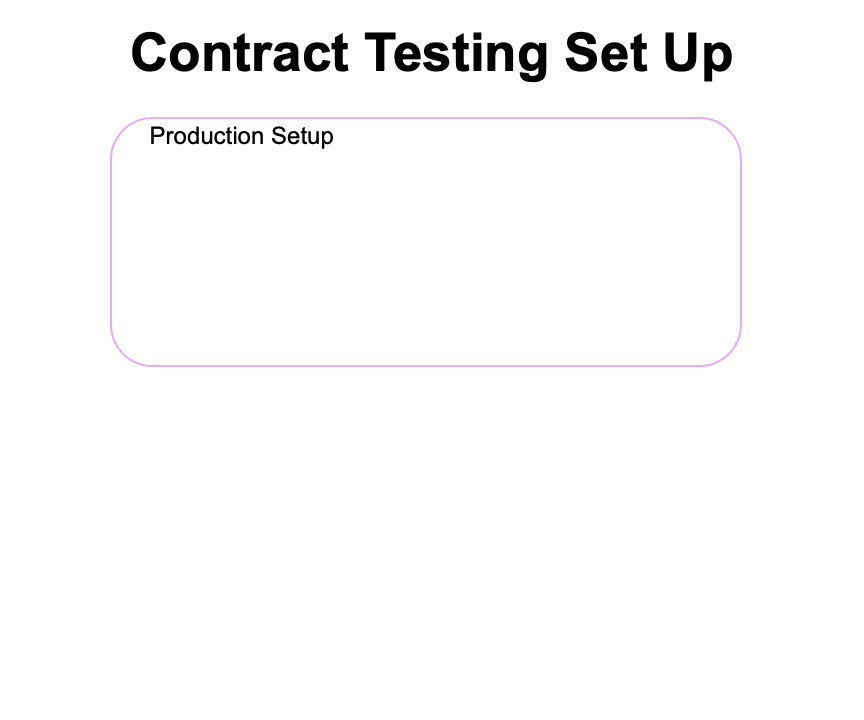

# Quick Start: Contract Testing Against a Real Service

## Objective
Run Specmatic against a real service implementation, see a contract failure, and fix the implementation without changing the contract.



## Why this lab matters
This is the core contract-driven development loop:
1. Keep the contract as source of truth.
2. Run contract tests against the running provider.
3. Use mismatch feedback to fix provider behavior.

If teams do this continuously, contract breaks are caught before release instead of in integration or production.

## Time required to complete this lab:
10-15 minutes.

## Prerequisites
- Docker is installed and running.
- You are in `labs/quick-start-contract-testing`.
- Port `8080` is available.

## Files in this lab
- `specs/service.yaml` - OpenAPI contract (source of truth for this lab).
- `service/server.py` - Tiny Python service implementation with one intentional mismatch.
- `docker-compose.yaml` - Runs provider (`petstore`) and test runner (`test`).

## Learner task
Make contract tests pass by changing provider response field `petType` to `type` in `service/server.py`.

## Lab Rules
- Do not edit `specs/service.yaml`.
- Do not edit `docker-compose.yaml`.
- Fix only the service implementation in `service/server.py`.

## Specmatic references
- Contract testing overview: [https://docs.specmatic.io/documentation/contract_testing.html](https://docs.specmatic.io/documentation/contract_testing.html)
- Understanding validation rules and mismatch codes: [https://docs.specmatic.io/rules](https://docs.specmatic.io/rules)
- Specmatic Studio: [https://docs.specmatic.io/documentation/studio.html](https://docs.specmatic.io/documentation/studio.html)

## Part A: Baseline run (intentional failure)
Run:

```shell
docker compose up test --build --abort-on-container-exit
```

```terminaloutput
Request to http://petstore:8080 at <date-time-stamp>
  GET /pets/1
  Specmatic-Response-Code: 200
  Host: petstore:8080
  Accept-Charset: UTF-8
  Accept: */*
  Content-Type: NOT SENT
  
Response at <date-time-stamp>
  200 OK
  Server: BaseHTTP/0.6 Python/3.14.3
  Date: <date-time-stamp>
  Content-Type: application/json
  Content-Length: 79
  
  {
      "id": 1,
      "name": "Scooby",
      "petType": "Golden Retriever",
      "status": "Adopted"
  }

Scenario: GET /pets/(petid:number) -> 200 with the request from the example 'SCOOBY_200_OK' has FAILED
```

Expected output:
```terminaloutput
Tests run: 1, Successes: 0, Failures: 1, Errors: 0
```

How did Specmatic generate the GET request for /pets with ID `1`?
- The request was generated from the inline example named `SCOOBY_200_OK` in `specs/service.yaml`.

How did Specmatic fail the test? (Expected failure reason:)
- Contract requires response field `type`.
- Service currently returns `petType`.

Ignore:
- You may also see `Could not find the Specmatic configuration at path /usr/src/app/specmatic.yaml`.
  In this lab, that message is expected because `test` runs directly with `./specs/service.yaml`.

Clean up:

```shell
docker compose down -v
```

## Part B: Fix the provider implementation
Open `service/server.py`.

In `do_GET()` under `/pets/`, replace:
```python
"petType": "Golden Retriever",
```
with:
```python
"type": "Golden Retriever",
```

Do not change anything else.

## Part C: Re-run tests (expected to pass)
Run:

```shell
docker compose up test --build --abort-on-container-exit
```

Expected output:
```terminaloutput
Tests run: 1, Successes: 1, Failures: 0, Errors: 0
```

Clean up:

```shell
docker compose down -v
```

## Optional: Run the same check in Studio
Start Studio and the provider:

```shell
docker compose --profile studio up --build studio
```

Open [Specmatic Studio](http://127.0.0.1:9000/_specmatic/studio), then:
1. Hover the small chevron on the left edge to open the file tree.
2. Expand `specs`.
3. Open `service.yaml`.

### Studio flow 1: Direct contract test
1. Go to the **Test** tab.
2. Set URL to `http://petstore:8080`.
3. Click **Run**.

You should observe the same fail-then-pass behavior based on whether `petType` is fixed to `type`.

### Studio flow 2: Expose a bug in the service
1. Starting from `service.yaml`, go to the **Examples** tab.
2. Click **Generate** to generate an example for GET /pets 200.
3. View the generated request/response payloads by clicking on the example name
4. Switch to the **Test** tab.
5. Set URL to `http://petstore:8080`.
6. Click **Run**.

Expected observations:
- Studio writes an externalized example under `specs/service_examples/`.
- The generated example name similar to as `pets_242.0_GET_200_1`.
- The test run now executes `2` scenarios instead of `1`.
- The newly generated-example scenario fails with `Connection is closed`.
- The Python handler raises a request-processing `ValueError` because `service/server.py` calls `int(pet_id)` however the generated pet id in the path segment contains a double (number) instead of an int. Generated pet_id was a double because the spec says petid is of type number not integer.

How to inspect the evidence:
- The Studio terminal shows the generated example file being written and later loaded during the test run.
- Provider logs show the `ValueError`.
- This reproduces a request-handler exception and closed connection for that scenario; do not assume the container always exits completely.

Stop services:
```shell
docker compose --profile studio down -v
```

## Pass criteria
- Baseline test run fails with one mismatch.
- After provider fix, test run passes with `1/1` success.

## Common confusion points
- Looking for `service/app.py` instead of `service/server.py`.
- Editing contract instead of provider code.
- Forgetting `--build` after changing service code (can run stale image).
- Using `localhost` instead of `127.0.0.1` in Studio URL on some setups.

## What you learned
- Contract testing validates a real implementation against the contract.
- The contract is the agreed behavior; your service implementation must conform to it.
- Specmatic gives actionable mismatch feedback to help fix implementation gaps.

## Next step
If you are doing this lab as part of an eLearning course, return to the eLearning site and continue with the next module.
